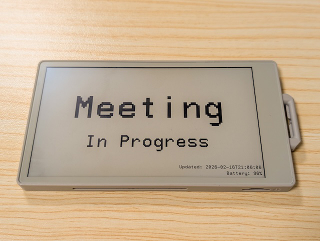
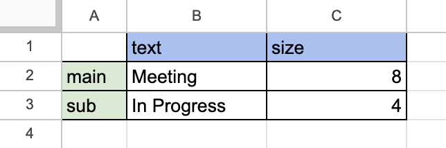

# M5Paper-Smart-Door-Sign

[日本語版はこちら](README.ja.md)



An ultra-low power, E-ink room status display for your home office. Remotely update your "Do Not Disturb" or "In a Meeting" status via Google Sheets.

## Features

* **Remote Update:** Change your status from anywhere using Google Sheets on your phone or PC.
* **Ultra-Low Power:** Utilizes M5Paper's Deep Sleep mode and E-ink display to last for weeks on a single charge.
* **Zero-Power Persistence:** The status remains visible even if the battery runs out.
* **Minimalist Design:** Clean UI with high-contrast Japanese/English font support.

## Hardware Requirements

* **M5Paper** (or M5PaperS3)
* Wi-Fi Connection
* USB-C cable for charging and programming

## System Architecture

1. **Google Sheets:** Acts as the controller. Manage main/sub text and size in a small table.
2. **Google Apps Script (GAS):** Serves the status as a JSON API.
3. **M5Paper:** Wakes up periodically, fetches the JSON via Wi-Fi, updates the E-ink screen, and goes back to sleep.

## Installation

### 1. Google Apps Script Setup

1. Create a new **Google Sheet**.
2. Create a table in **A1:C3** following the format below.
3. Go to `Extensions` > `Apps Script` and paste the code from `gas/gas.gs`.
4. Deploy as a **Web App** and set access to **"Anyone"**.
5. Copy the provided **Web App URL**.

#### Table format

|      | text | size |
|:-----|:-----|:-----|
| main |      |      |
| sub  |      |      |


### 2. Firmware Setup

1. Open `main.ino` in Arduino IDE.
2. Create a `config.h` file in the same tab and fill in your credentials:

```cpp
// WiFi Configuration
const char *SSID = "YOUR_WIFI_SSID";
const char *PASS = "YOUR_WIFI_PASS";

// GAS Configuration
const char *GAS_URL = "YOUR_GAS_URL";

// NTP Configuration
const char* NTP_SERVER = "pool.ntp.org";
const long GMT_OFFSET_SEC = 9 * 3600; // Japan Standard Time (GMT+9). Change as needed.
const int DAYLIGHT_OFFSET_SEC = 0;

// Update interval (minutes)
const int SLEEP_MIN = 10;
```

(cf. `config.h.example`)

1. Install dependencies: `M5Unified`, `M5GFX`, and `ArduinoJson`.
2. Upload the code to your M5Paper.

## Usage

* The display will update every `SLEEP_MIN` minutes.
* To change the message, edit the `main` / `sub` rows in your Google Sheet (`text` and `size` columns) .
* The device uses `M5.Power.timerSleep()` to minimize power consumption between updates.
* The "off" button in the top-right corner is shown only on the Wi-Fi connection screen.
* During the Wi-Fi connection screen (up to 10 seconds, with a minimum 1-second display), touch "off" to enter indefinite power-off mode.
  * To restart the device, press the power button on the M5Paper.

### Table example

|      | text        | size |
|:-----|:------------|:-----|
| main | Meeting     | 8    |
| sub  | In Progress | 4    |



## License

MIT License
